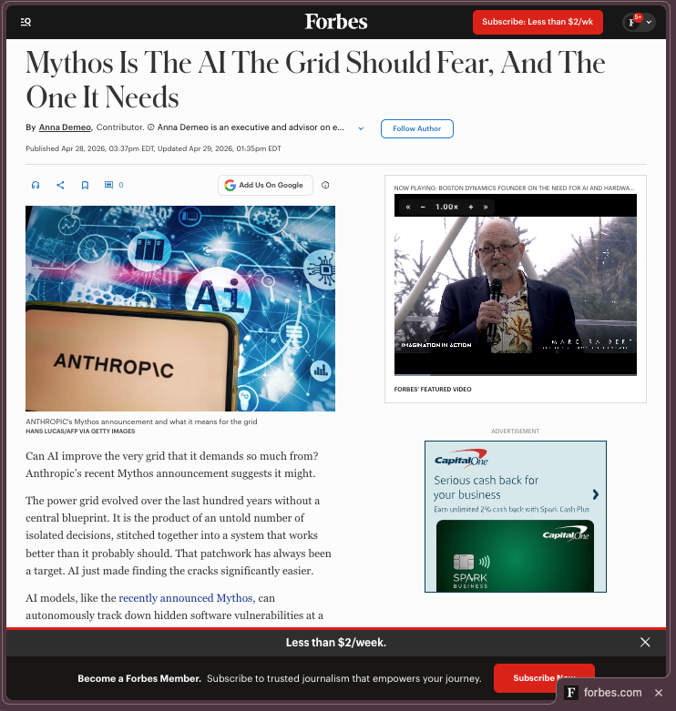
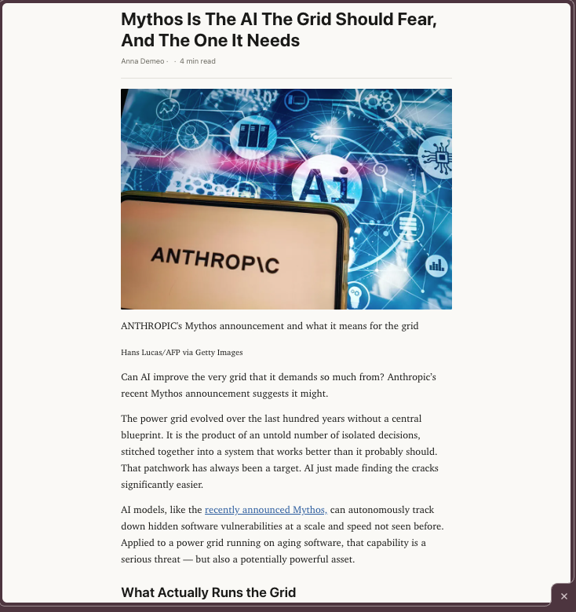
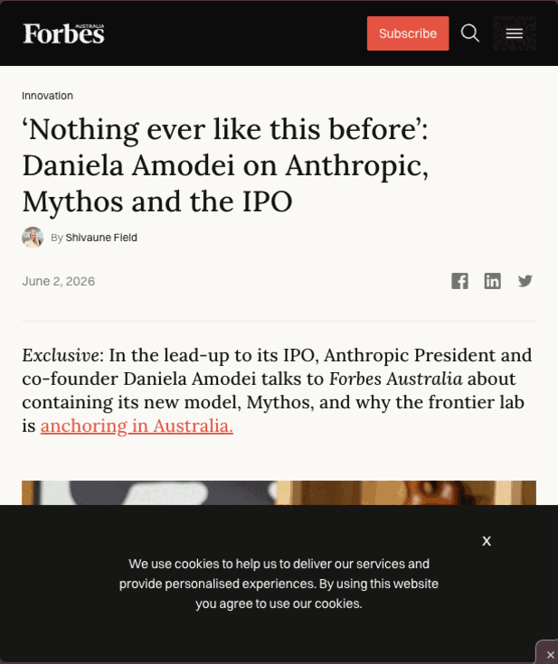
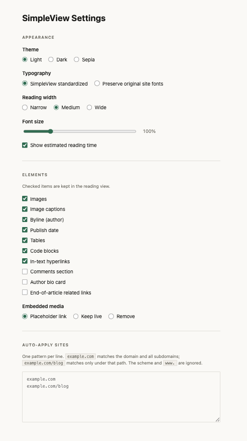

# SimpleView

**A Chrome extension that re-renders any article as an ultra-simple, distraction-free
reading page — one click in, one click out.**

Modern article pages bury their text under video ads, animated banners, pop-ups,
newsletter prompts, and floating widgets. SimpleView strips all of that away and
re-renders just the article — headline, byline, text, and images — in a clean, quiet,
typographically careful reading view. Click the toolbar icon again and the original
page comes right back, untouched.

No accounts. No analytics. No network requests. The simplified page is fully static —
every script and tracker from the original page is removed.

---

## ✨ What it looks like

<!-- Visual examples — replace the placeholders below with real screenshots/GIFs. -->

| Before | After | Light, dark & sepia themes |
|---|---|---|
|  |  |  |

---

## 🔧 Installation

SimpleView is loaded as an unpacked extension (Chrome Web Store release TBD):

1. Download or clone this repository:
   ```
   git clone https://github.com/TyJPerez/SimpleViewChrome.git
   ```
2. Open Chrome and go to `chrome://extensions`.
3. Turn on **Developer mode** (toggle in the top-right corner).
4. Click **Load unpacked** and select the `SimpleViewChrome` folder.
5. (Optional) Click the puzzle-piece icon in the toolbar and pin **SimpleView**.

## 🖱 How to use

- **Click the SimpleView toolbar icon** to simplify the current tab. The badge shows
  `ON` while the reading view is active.
- **Click it again** to restore the original page exactly as it was — no reload.
- If a page has no readable article (dashboards, web apps, search results), SimpleView
  shows a brief "No article found" notice and leaves the page alone.
- The footer of every simplified page also has a **View original** link.

## ⚙️ Settings

Right-click the toolbar icon → **Options** (or open it from `chrome://extensions`).
Changes save automatically and apply live — even to a reading view you already have open.




### Appearance
| Setting | Choices | Default |
|---|---|---|
| **Theme** | Light · Dark · Sepia | Light |
| **Typography** | SimpleView's reading typeface · Preserve the site's original fonts | SimpleView |
| **Reading width** | Narrow · Medium · Wide | Medium |
| **Font size** | 85% – 150% | 100% |
| **Estimated reading time** | Show / hide in the byline row | Show |

### Elements
Choose exactly what appears in the reading view:

- **Kept by default:** images, image captions, byline, publish date, tables, code
  blocks, in-text links
- **Removed by default:** comments sections, author bio cards, end-of-article
  "related links"
- **Embedded media** (YouTube players, tweets, audio): choose **placeholder link**
  (a quiet card linking to the source — the default), **keep live**, or **remove**

### Auto-apply sites
List sites that should *always* open in SimpleView — one per line:

```
example.com          ← whole domain, subdomains included
example.com/blog     ← only under that path
```

Scheme and `www.` are ignored. You can still toggle back to the original on any
auto-applied page.

## 🔒 Privacy

- **No data collection of any kind.** Nothing is logged, sent, or phoned home.
- Your settings live in Chrome's own extension storage (synced with your Chrome
  profile if you use Chrome sync).
- The extension makes **zero network requests** — article extraction happens entirely
  on your machine, using a bundled copy of
  [Mozilla Readability](https://github.com/mozilla/readability), the library behind
  Firefox's Reader Mode.
- Simplified pages are inert: all scripts, trackers, and third-party frames from the
  original page are stripped.

## 📄 License

MIT — see [LICENSE](LICENSE). The bundled Mozilla Readability library is Apache 2.0 —
see [THIRD_PARTY_NOTICES.md](THIRD_PARTY_NOTICES.md).
